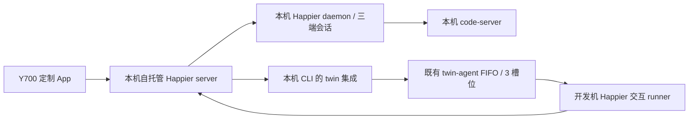

# Y700 私有 Android App 定制路线

- 状态：APPROVED_EXECUTION；合约修订：2；日期：2026-09-20。
- 存放位置：依用户最新指定，方案与 WeTAMP 定制资料统一放在仓库 `wetamp/`，覆盖此前 `.project/plans/` 的默认位置建议。
- 用户要求：基于已复刻的 Happier 私有库定制；Y700 以触屏和手机热点为主；控制双机 Claude Code / Codex / OpenCode；code-server 留在本机主力开发机；定制必须支持持续合并、验证和交付上游升级。
- 本次授权：用户于 2026-09-20 明确要求按本方案实现、将 APK 安装到已连接的 Y700，并实现本机与开发机的安全公网操控；授权执行 P0-P4 中服务这些结果的本地实现、构建、安装、服务配置和真机验证。未授权 `git commit`、`git push`、公开发布源码、匿名公网暴露或绕过既有认证/E2EE。
- 实现批准记录：合约修订 2 已由用户当前指令批准执行。本机是源码事实源与控制面；开发机仍通过 twin-agent 统一队列参与核验和后续受控集成。
- 前序关系：修订工作区 `_bmad-output/planning-artifacts/y700-remote-ai-2026-09-20/SOLUTION.md` 与 `ARCHITECTURE-SPINE.md` 的建议。保留现成 App、原生任务入口、三端、E2EE、统一远端队列；将 code-server 明确放回本机；撤回默认远端 review 快照发布器及预先拆分 `packages/twin-control` / `packages/twin-review` 的建议。旧文档作为历史调研保留，不作为当前实施依据。

## 1. 定制结论

继续使用现有 React Native / Expo App、CLI 和 server。先在当前 fork 上获得能独立运行的自有 APK，跑通本机三端和审查，再完成开发机受控交互会话。远端集成涉及现有 twin-agent 执行器，不能只改 Android 界面。

完整目标包含两台机器的三种 Agent；分阶段交付不等于把开发机降为只读查看，或用一次性后台 job 冒充可继续对话的会话。所有创建任务、继续对话、停止、权限处理均在 App 原生界面完成；code-server 仅承接深入代码审查。

## 2. 当前源码与环境证据

私有仓库 `https://github.com/toagent/happier`，本次 HEAD `56fd1ce5b`，分支 `dev` 跟踪 `origin/dev`。UI/server 标称 `0.2.12`，CLI `0.2.13`；这些 package 版本不等于已通过对应稳定发布验证。仅配置 origin；本次未 fetch、切换或创建分支。

| 能力 | 现有 owner / 证据 | 定制判断 |
| --- | --- | --- |
| App 身份覆盖 | `apps/ui/app.config.js`：`EXPO_APP_LOCAL_CONFIG_PATH`、`app.local.js`、`EXPO_APP_NAME`、`EXPO_ANDROID_PACKAGE`、scheme、link host、EAS 与 updates 配置 | 用配置覆盖，保留上游默认配置；无须全仓改名 |
| 原生基础 | `apps/ui/package.json`：Expo 54、React Native 0.81.5、expo-web-browser、react-native-webview、Android 与 typecheck 脚本 | 继续现有技术栈；首个交付包必须脱离 Metro/USB 运行 |
| 三种 AI | `apps/cli/src/backends/catalog.ts` 注册 claude/codex/opencode；`backends/<provider>/` 为执行实现 | 不再写模型聊天客户端；保留 provider 配置并分别实测 |
| 新会话与选机器 | `components/sessions/new/hooks/useCreateNewSession.ts` → `sync/ops/machines.ts` 的 `machineSpawnNewSession` → machine RPC | 复用机器/目录/Agent 选择；默认主力本机，记住项目选择 |
| 实际执行 | `apps/cli/src/api/machine/rpcHandlers.ts` 调用 `spawnSession`，`apps/cli/src/daemon/startDaemon.ts` 拥有启动和恢复生命周期 | 队列限制必须落实在执行路径，不能只禁用 App 按钮 |
| 平板布局 | `components/navigation/shell/SidebarNavigator.tsx`、`utils/platform/responsive.ts`、`viewportClass.ts`、`components/appShell/panes/` | 已有侧栏和面板；在原 owner 调整宽度/收起规则 |
| 待处理 | `components/inbox/useInboxContentModel.ts` 聚合 approval、需要关注的会话与 review，会带机器/工作区上下文 | 沿用 Inbox，不另建一套待处理状态 |
| 原生审查 | `components/sessions/files/views/SessionScmReviewDetailsView.tsx` 组合 ChangedFilesReview、评论草稿、SCM snapshot；`reviews/comments/useReviewComposerHandoff.ts` 返回输入区 | 扩展已有审查页并验证评论发送链路，不重新造 diff 编辑器 |
| 弱网与刷新 | `sync/engine/pending/pendingQueueV2.ts` 使用持久 outbox 与服务器确认；`scm/refresh/useScmAdaptivePolling.ts` 根据 AppState 暂停刷新 | 优先验证和调整现有机制，不增加另一套消息队列 |
| 外部链接 | `utils/url/openExternalUrl.ts` 原生分支调用 Linking.openURL | 现有函数不是 Android Custom Tabs；code-server 的应用内浏览入口需要明确接入 |

表中未以 `apps/` 开头的 UI 路径均相对 `apps/ui/sources/`。以上是源码能力与落点，不代表 Y700 实测通过。

首次调查时没有安装根/UI node_modules，没有生成 `apps/ui/android`，没有 `apps/ui/app.local.js`。本次迁移前发现用户已修改 `.gitignore` 来忽略 `.idea/`，保留原样。本文已从被忽略的 `.project/plans/` 迁入 Git 可跟踪的 `wetamp/plans/`，尚未暂存或提交。

本次开发机只读探测：M3 Max / 48 GB / 可用约 435 GiB；Node 26.8.2、Yarn 1.22.22、Bun 1.4.2、Temurin JDK 17 已安装。但常规 Android SDK 不存在、sdkmanager 不在 PATH、jenv shim 损坏，依赖源探测被失效代理 `127.0.0.1:7890` 阻断。adb 文件存在但版本命令未正常返回。不能现在宣称开发机可构建 APK；JDK17 也不代表当前 fork 的 Gradle 配置已兼容。

同日此前核验的设备记录：Y700 TB323FU，Android 16/API36、arm64-v8a、1904×3040，density override 482。粗算约 632×1009 dp，实际布局须读取应用窗口与 inset；不能按 3040 像素当作宽屏桌面。此前本机 code-server 为 `127.0.0.1:8842`，域名配置 `review.toagent.io` 指向它；本轮未再次测外网访问。本文不将这些历史配置当作新部署或热点连通证明。

## 3. 必须满足的使用结果

| ID | 用户可见结果 | 完成证据 |
| --- | --- | --- |
| R1 | 自有 Android APK，基于此私有 fork；任务全程原生操作 | Y700 脱离 USB/Metro，通过热点创建任务、回复、停止和处理权限 |
| R2 | 双机各三种 Agent 可选，机器/项目/Agent 身份明确 | 六条目标路径实际执行、追问与停止；不能将六入口显示当通过 |
| R3 | 本机 code-server 审查正确目录，原生 diff 可快速阅读和反馈 | 同一测试改动在 App 与本机 code-server 一致，返回原会话继续修改 |
| R4 | 触屏、旋转、软键盘和长输出可用 | Y700 横竖屏、分屏、键盘打开、大字体和长 diff 的实际操作录像/记录 |
| R5 | 热点断线与锁屏不中断 Mac 工作，恢复不重复执行 | 发送后断网/切热点、锁屏、杀 App 后重开，历史及草稿恢复，启动次数不重复 |
| R6 | 开发机共用 twin-agent FIFO，最多三个运行任务 | 与现有 MCP 混合提交四个任务，第四个排队；取消、退出、重连、恢复均不旁路 |
| R7 | 个人构建身份、升级与通知可控 | 包名/签名/配置核验，覆盖安装保留配对；自有推送真实到达；无上游 OTA 覆盖 |
| R8 | 私有定制可持续跟进 Happier 上游代码升级 | 按 [上游升级约定](../UPSTREAM.md) 记录精确来源与定制接入点，完成一次真实候选版本合并及受影响功能/数据升级验证；合并无冲突不等于兼容通过 |

本机仍为控制面。`local_snapshot` 以本机为准并走隔离任务/patch 回收；`remote_workspace` 以指定开发机工作区为准。不能依据两台机器同名路径或 Unison 文件同步推断 Git 状态一致。现有 Git 提交、推送与部署人工边界继续适用。

## 4. 产品与技术设计建议

### 4.1 App 的第一屏与 Y700 布局

第一屏回到最近项目/会话；高频入口保留会话、待处理、变更与机器，但先在现有导航/Inbox/会话工具栏组织，不预先重写成全新四 Tab 系统。

- 新任务默认本机，选择机器、项目目录、Claude/Codex/OpenCode；常用项目置顶，提供“实现、评审、测试”等输入模板，模板不隐藏权限和目标目录。
- 竖屏默认会话主区，侧栏可收起；横屏展示项目/会话列表与主区，审查替换主区或使用既有面板。约 8.8 英寸设备不默认强塞三栏。
- 输入法打开、Android 分屏或大字体导致宽度不足时自动采用窄布局；同一会话不因旋转重新创建。按实际可用宽度布局，不硬编码 Y700 型号。
- 沿用现有 Unistyles、Text/TextInput、pane 状态和国际化；主要触控区域至少 48 dp，批准与停止分开，长工具输出可折叠，代码块和 diff 支持横向查看/换行选择。
- 输入法语音转文字可先作为中文输入方式；不为首版增加新的付费语音模型链路。社交等低频项是否隐藏通过现有功能配置决定，不删 provider 或恢复核心。

### 4.2 本机 code-server 与原生审查

默认在现有 ChangedFilesReview 阅读文件和 diff，复用评论草稿/回到输入区的链路。新增“在本机 code-server 打开”动作，使用会话实际工作区目录；目录只允许来自已认证机器会话与已配置项目范围，构造 URL 时编码参数，密码不放 URL。

新增配置应归现有设置 schema 与机器/工作区上下文：保存本机 review base URL，不将 `review.toagent.io` 散落到组件。URL 构造放 `utils/url/` 小型工具；界面按钮留在 `components/sessions/files/`。具体设置字段与文件名由实施时沿现有 schema 确定。

Android 默认通过现有 `expo-web-browser` 依赖接入 Custom Tabs，进入 code-server 审查后返回原任务。任务创建与批准仍在原生 App。若要聊天与完整 IDE 固定同屏，可先使用 Android 分屏；首版不默认加入 WebView 的认证、下载与编辑器兼容维护负担。

三种审查来源必须明确：

1. 本机任务：code-server 打开真实工作区或该任务本机 worktree，无需复制到开发机。
2. 远端 `local_snapshot`：复用 `fetch_job_patch` 与 dry-run；需要应用前 code-server 审查时，在本机从对应基线准备临时 review worktree，应用同一个 patch。获准后才在实际目标应用并最小验证。不能把临时 review 副本与最终工作区混为一谈。
3. `remote_workspace`：原生 SCM 查看真实远端状态，不把远端绝对路径直接交给本机 code-server。需要深入审查时显式导出基线与改动到本机临时 review worktree；这是只用于审查的副本，不能调用本机 `apply_job_patch` 改主力项目。这条导出路径尚待实现和验证，是完整 R3 的一部分。

上述临时 worktree 只在确有远端审查需要时建立；不为所有本机任务增加 snapshot publisher、归档服务或新 manifest 协议。显示机器、目录、基线与数据时间；底层工作区变化后提示刷新，不能假装旧 diff 仍代表当前变更。

### 4.3 远端执行：唯一需要跨仓打通的核心

已核对 `~/.lan-dev-machine/twin-agent/server.mjs` 的 `delegate_agent` schema 与 README：当前为 prompt/job 任务接口，具备 FIFO、超时、取消、进度、patch 与验收统计；没有暴露通用的持续会话输入/权限回复接口。当前批处理执行策略含 Codex ephemeral、Claude bare、OpenCode pure；不能据此承诺复用完整交互会话、hooks 与插件。

建议使用以下职责边界：

这是目标拓扑；`twin 集成`与受调度的交互 runner 尚不存在。队列决定是否可运行，Happier 决定会话消息、加密、权限交互和 provider 执行。App 仅呈现目标与状态，不另起 HTTP 调度服务或第二队列。

建议将 Happier 侧适配放在 CLI 既有 `src/integrations/` 下的 twin domain；协议需要新能力时遵循 `packages/protocol` 的版本与能力协商，UI 经现有 ops 调用。twin-agent 一侧扩展当前调度执行类型，让已入队任务启动 Happier runner，保留现有一次性任务契约。准确入口必须在开始该阶段时追踪 `twin-agent-remote` 的出队、退出及清理代码后确定，不能凭当前 MCP schema 直接修改运行器。

运行中的交互会话计入现有三个槽位，等待用户回复时亦不可伪装为已退出；明确结束后释放，后续 resume 再排队。App 失联不等于取消。既有 job timeout 不应被未经讨论地套用为所有交互会话寿命；该阶段先确定用户等待、硬超时、退出、恢复的具体行为再实现。

启动限制必须覆盖新建、resume、fork、后台恢复、handoff 以及已有 daemon 的直接 spawn；兼容失败返回可解释的不可用状态，不能回退直启。不能仅在新建页面打补丁。所有批处理/MCP 与 App 交互会话共享同一个队列 owner。

旧 CLI 不认识新能力时，开发机交互入口保持不可用，本机现有会话继续工作。不得静默替换成一次性 job；已有原生 pending outbox 与 spawn nonce 继续负责同一会话发送/启动去重，避免再造一套客户端 ID 与恢复日志。

### 4.4 网络、后台和升级

首选 Tailscale 内 HTTPS 访问本机 Happier server 与 code-server，保留应用认证/E2EE。本机网络或服务不可达时展示连接问题并保留已加载内容；不自动把控制面切到开发机。Mac 长任务独立于 Y700 前后台；本机睡眠、断电或重启前未解锁会影响可用性，需要真实验证。

手机热点在 Y700 上表现为 Wi-Fi，不能仅靠 Wi-Fi 类型启用大附件/后台预取。提供显式省流偏好，默认按需加载 diff/附件，沿用现有 AppState 和缓存刷新 owner。先记录一次固定任务的流量、恢复时间和滚动表现，再依据实测优化，不承诺未经测量的流量或延迟数字。

私有构建配置建议放可追踪的 `wetamp/config/app.cjs`，通过现有 `EXPO_APP_LOCAL_CONFIG_PATH` 加载。构建入口从当前 checkout 计算绝对路径，兼顾本地、隔离工作区和 CI，不硬编码个人目录；Expo 资源路径、EAS 上传范围和配置解析在 P0 验证。配置文件与构建入口尚未创建。包名可用 `io.toagent.remote`，名称暂用 `ToAgent Remote`，两者均为待发布前确定的建议值。独立 scheme/link host、签名、Expo/FCM 身份、server URL；不借用上游 OTA、Firebase 和 EAS 身份。首轮可关闭 OTA，用同签名的 release APK 升级；启用自有 OTA 留到 APK 基线可靠之后。

通知复用现有 expo-notifications 与服务端通知链路，使用自有项目凭据，默认仅提示有待处理事项。Google 服务包存在不等于热点可送达；锁屏、后台、杀 App 与系统强行停止分别记录结果。推送不足时 App 恢复仍须补齐待处理，不以永久前台保活掩盖缺口。

### 4.5 上游升级与定制隔离

以 [wetamp/README.md](../README.md) 为定制入口，[wetamp/UPSTREAM.md](../UPSTREAM.md) 为升级流程与兼容验收的唯一维护约定。`wetamp/` 集中保存专属方案、配置、品牌资源和维护脚本；上游 App、CLI、server、provider、协议及状态 owner 继续沿用原目录，不复制到 `wetamp/`。

优先使用上游已存在的配置入口和 canonical owner。新增 UI/CLI 逻辑仍归对应包，必要接线有测试和升级记录；不从根 `wetamp/` 跨包导入业务实现，也不为隔离形式另造一套状态或 provider。通用修复保持通用、便于以后回馈上游；私有产品默认值通过 WeTAMP 配置限定，不将上游消费者强制改为私人工作流。

升级可维护性同时覆盖源码合并、UI/CLI/server 混合版本、已有数据、APK 签名/包名和回退。不得以目录分离承诺永远无冲突，也不得把尚未执行的升级验证写成兼容成功。上游替换 owner 时按最终行为适配接入点，不永久冻结旧实现。

## 5. 分阶段实施与验收

| 阶段 | 范围与 owner | 可验收产出及依赖 |
| --- | --- | --- |
| P0：原版基线 + 自有安装包 | `wetamp/config/`、`wetamp/scripts/`（计划新增），`apps/ui/app.config.js` 现有覆盖入口和 build scripts | 确认当前 fork/上游来源/锁文件/Node 兼容版本，建立定制接入点记录；修复所选构建机 SDK/JDK/代理；生成配置检查包名、server URL、updates、FCM；构建并安装可独立运行的签名 APK。UI/CLI/server/provider 版本记录完整。R1/R7/R8 基础 |
| P1：本机三端可用 | `sessions/new`、现有 server 配置与 CLI daemon/provider | 本机自托管 server 配对；三个 provider 分别完成真实任务、追问、权限拒绝/允许与停止；核对本机 AGENTS、MCP、hooks、skills 加载，不假定包装后自动一致。R1/R2 本机部分 |
| P2：Y700 审查与操作 | SidebarNavigator/panes、Inbox、SessionScmReviewDetailsView、settings、URL 工具 | 横竖屏/键盘、大字体；原生 diff/评论返回同一会话；Custom Tabs 打开本机实际目录，返回保留草稿与位置。R3 本机部分/R4 |
| P3：开发机交互集成 | Happier CLI twin domain、必要 protocol/ops，现有 twin-agent scheduler/runner | 先完成运行器生命周期接缝核验，确定交互超时与占槽规则；落通三种 provider 的新建/追问/批准/停止/恢复；与 MCP 混合任务保持 3 槽位。补齐两种 workspace 的本机深入审查路径。R2 远端部分/R3 远端部分/R6 |
| P4：热点日常验收与升级 | 现有 pending/sync、SCM 刷新、通知、APK 构建配置；`wetamp/UPSTREAM.md` 的升级流程 | 断网恢复不重复执行；锁屏期间 Mac 继续工作；自有推送/深链接；覆盖升级保留配对/密钥。按热点实测调整省流与预取；对真实上游候选完成一次合并、受影响混合版本和数据升级验证，留存结果。完成 R5/R7/R8，复跑受影响 R1–R4/R6 |

P0 首包可先验证身份与前台操作，推送未接通必须标明，不能将其算完整交付。P3 可以独立研究接缝，但不得在 P1 未证明 Happier 三端核心可用时大规模改写调度。P0/P1 为最先应执行的一批工作。

现有自动化资产按变更使用：

- 身份配置：`apps/ui/sources/__tests__/config/appConfig.easDefaults.test.ts`、`googleServices.variantPackages.test.ts`、`easJson.androidGradleCommands.test.ts`。
- 机器/发送：`useCreateNewSession.daemonUnavailable.test.tsx`、`sync/ops/machines.spawn.errorMapping.test.ts`、pending outbox replay/acknowledgement 测试；新增断线后重复提交不重复启动的跨边界场景。
- UI：`SidebarNavigator.collapsed.test.tsx`、`SessionScmReviewDetailsView.snapshotSWR.test.tsx`、`ChangedFilesReviewDiffBlock.nativeReadingAnchor.test.tsx`；调整对应 owner 后运行精确切片。
- CLI：`apps/cli/src/api/apiMachine.spawnSession.test.ts`、`apps/cli/src/daemon/startDaemon.tmuxSpawn.integration.test.ts` 及受影响生命周期测试。P3 添加队列混合调用/取消/恢复的真实边界测试。
- 类型检查：`yarn workspace @happier-dev/app typecheck`；触及 CLI 时 `yarn workspace @happier-dev/cli typecheck`，使用仓库脚本，不用裸 tsc。
- 真机：根 `yarn test:e2e:mobile:android:connected-machine` 与 `yarn test:e2e:mobile:android:validated` 为现有入口，按 harness 前置条件配置，不能声称可无配置运行。自动化不覆盖的热点/推送/code-server 输入法场景需人工触屏验收。

## 6. 决策、限制与完成标准

已明确的用户决定：私有 Happier fork、自定义 Android App、触屏/热点优先、双机三端、code-server 本机、资料写入 `wetamp/`、兼容后续上游升级。上述任何一个不能由实现者自行删减。

本草案推荐但尚未形成批准执行契约：本机自托管 Happier server、Custom Tabs 审查、`wetamp/` 内的具体构建配置文件、分阶段顺序、twin-agent 增加 Happier runner 类型。实施细节可复用现有 owner 调整；不得通过直接启动开发机 AI 来规避集成。

发布前需固定：正式 App 名/包名、签名保管与备份、自有 Expo/FCM 项目、HTTPS 服务地址。包名/签名在已有用户数据后修改涉及重新安装或迁移，不能当普通文案调整；首次试验包与正式包应明确区分。Android 回退需同签名且更高 versionCode 的回退构建，并验证数据兼容，不能承诺直接降级覆盖。

P3 的剩余设计决定：现有 scheduler/runner 的准确扩展位置、交互等待与 timeout 行为、remote_workspace 审查导出细节。这些不阻塞 P0/P1，但必须在 P3 写代码前补充到草案并确认为执行契约；当前不能估算为简单机器选择小改。

不默认加入：独立聊天服务、第二队列、新 Kotlin App、全仓品牌替换、为本机任务复制代码到开发机、全量重写导航、独立 review 发布服务、未测量的“省流倍数”。保留现有许可证与第三方声明。

R1–R8 的外层行为均有实际证据才算完成。单测通过、界面按钮存在、模拟 provider、单次局域网成功、远端 exit_code=0 或 Git 合并无冲突都不能替代真实双机/三端/热点/升级验收。记录已测版本、设备、网络、操作与结果；任何未通过项明确保留，不标全量完成。

## 7. 执行跟踪（非设计合约）

- 源码与环境调查：已完成；开发机任务 `20260920052109-adf29b`，Codex，只读，93 秒，已回收并验收，无 patch。
- 规划：DRAFT 已形成；自查确认现有 UI/SCM/Inbox 可复用、原始 spawn 旁路风险、远端批处理不等于交互会话、code-server 目录一致性及构建环境缺口。
- 2026-09-20 用户追加要求已纳入修订 2：迁入 `wetamp/`，补 R8、定制归属、上游合并/混合版本/数据与回退验证。只修订文档，未执行上游升级。
- P0：IN_PROGRESS；P1-P4：PLANNED，按依赖逐步实施。
- 本次验证：源码/配置只读核对；文档空白与链接路径检查；未安装依赖、未运行产品单测/typecheck、未构建 APK、未部署或真机验证。
